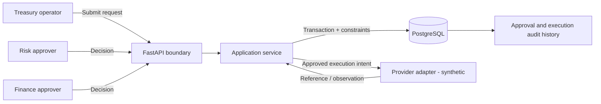

# Internal Transfer Approval Service

Synthetic FastAPI portfolio demonstration for an internal treasury-style workflow. It shows how a small service can make separation of duties, approval state, idempotent execution, data constraints, and audit history explicit.

This is not a production payment system and does not represent work performed for an employer or client.

## Business problem

A treasury team needs to request internal funds transfers. A request must receive two independent approvals, the requester cannot approve their own request, rejection is final, and execution retries must never create a second side effect.

## Implemented controls

- Typed FastAPI/Pydantic request and response contracts.
- Exact decimal amounts and explicit three-letter currencies.
- PostgreSQL-ready SQLAlchemy models with positive-amount, uniqueness, and foreign-key constraints.
- Explicit Alembic schema migration with upgrade and downgrade verification.
- Stable client request IDs for duplicate-safe submission.
- Conflict detection when a request ID is reused with different transfer data.
- Separation of duties and two-person approval.
- Append-only approval decisions.
- Idempotency keys for duplicate-safe execution.
- Structured domain errors, eight API acceptance tests, and one migration smoke test.
- Docker Compose path using PostgreSQL 17.

## Run locally

```bash
poetry install
poetry run alembic upgrade head
poetry run uvicorn app.main:app --reload
```

Open `http://localhost:8000/docs` for the generated OpenAPI interface. The local default is SQLite for a fast demonstration.

For PostgreSQL:

```bash
docker compose up --build
```

## Verify

```bash
poetry run ruff check app migrations scripts tests
poetry run mypy app scripts
poetry run pytest
```

## API flow

1. `POST /transfers` with a stable `client_request_id`.
2. `POST /transfers/{id}/decisions` from two different approvers.
3. `POST /transfers/{id}/execute` with an `Idempotency-Key` header.
4. Repeat the execution request to observe the same result and `Idempotent-Replay: true`.

Run the complete synthetic walkthrough without starting a server:

```bash
poetry run python scripts/demo.py
```

Each line is structured JSON showing the HTTP result, transfer state, approval count, execution count, and whether the final call was an idempotent replay.

## Architecture



The route layer owns HTTP contracts, the application service owns state transitions and transaction intent, and database constraints backstop concurrency-sensitive invariants. A production provider call would be decoupled through a transactional outbox and durable worker.

## Important decisions

- Database constraints backstop application checks because concurrent requests can pass an application-level pre-check.
- An idempotency key is bound to its original payload; reusing it with different data returns a conflict.
- Provider observations would be stored separately from accepted internal state in a production integration.
- The execution endpoint uses a synthetic provider reference. A real adapter would persist an execution intent and transactional outbox record before making an external call.
- SQLite is used only for quick local tests. Production verification must exercise PostgreSQL migrations, isolation, query plans, backups, and recovery.
- The application does not create tables during startup. Alembic owns schema changes; the container applies pending migrations before serving.

## Production extensions

- Authentication, tenancy, role-based authorization, and managed secrets.
- PostgreSQL-backed migration and API integration tests in an environment where PostgreSQL is available.
- Transactional outbox and durable worker for provider execution.
- Provider timeout classification, status queries, and reconciliation.
- Immutable actor identity from authentication rather than request bodies.
- Structured logs, traces, business metrics, alerting, and operator runbooks.
- Retention, encryption, backup/restore tests, and controlled override workflows.

## Non-goals

- Moving real funds.
- Implementing a specific exchange, custody, bank, KYC, or AML integration.
- Claiming production scale, latency, availability, or regulatory compliance.
